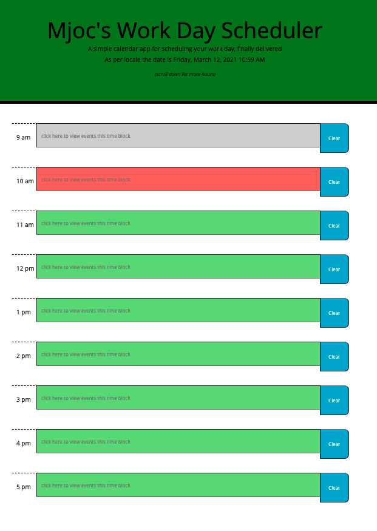
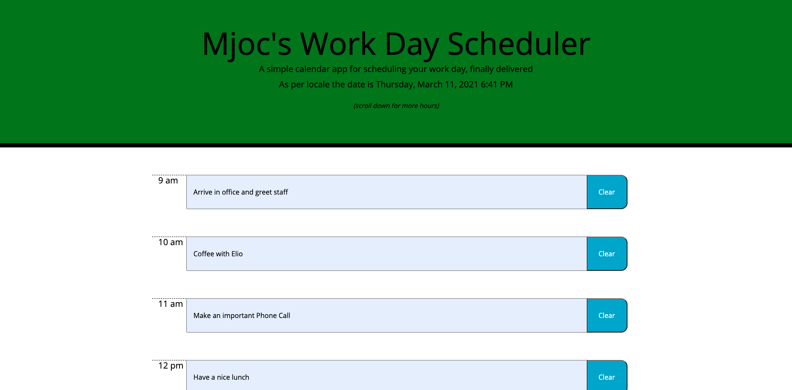
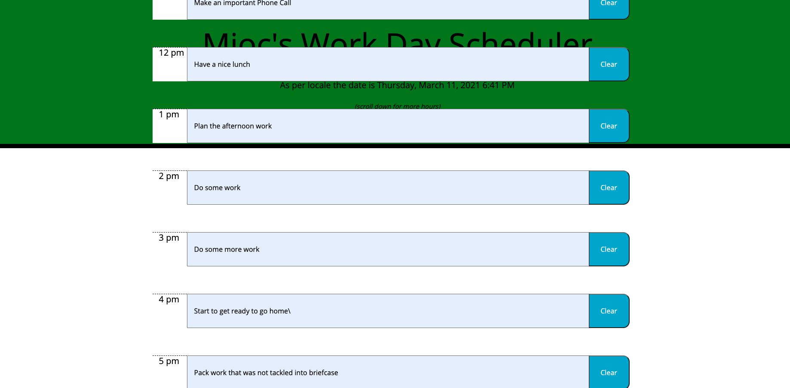

# Assignment05

This is the repo for the Code Quiz assignment 05, due Jan 28, 2021.

# Unit 05 Javascript Homework: Day Planner

Submitted: March 12, 2021, Michael O'Connor, 604 765-6061

# 01 Goal: 

    The Goal of this project is to create a simple calendar application that allows a user 
    to save events for each hour of the day by modifying starter code. This app will run in
    the browser and feature dynamically updated HTML and where possible CSS powered by
    jQuery. Here is a link to the Github folder https://github.com/Emjayosee/Assignment05 and 
    a link to the deployed website https://emjayosee.github.io/Assignment05/.

# 02 Approach:

    In approaching this project, I fell behind and had to go back about a month to pick it up 
    again, with so many advances, I spent several hours trying to achieve the objectives.  This 
    is what I have so far, it meets a number of the requirements, and by accident includes what 
    I will call a "privacy shield" so that the user clicks te window to see events.  

    I followed the following plan design:

            Goal:

            Develop a calendar that can be used to plan out each day, with some user 
            requested features, like colour coding of the event time blocks.

            Design:

            [X]	WHEN the user opens the planner the current day and time is displayed at the 
                top of the calendar
            [X]	WHEN the user scrolls down the user is presented with timeblocks for standard
                 business hours
            [X] Each timeblock is color coded to indicate whether it is in the past, present, or 
                future
            [X] WHEN the user views the timeblocks for that day, and clicks the time block to
                  bypass the privacy screen, the events are listed
            [X] WHEN the user clicks into a timeblock, the user can enter an event and it is 
                saved in the background and can be recalled by clicking on the text area 
                again presumably in local storage and when the page is refreshed the saved 
                events persist   
            
            Here is the basic logic flow :

                [X] On load, display introduction and directions

                [X] User is advised to click the text area to add an entry

                [X] User can see the entries by clicking the field

                [X] When the page loads the schedule refreshed the boxes and displays a colour 
                    for past, present and future.

            Build:
            •	Set up three files, index.html, script.js and style.css (add to Github) [x]
            
            HTML:
                >Layout for Landing page [x]
                >Schedule of events by hour 9 to 5 [x]
                >CSS [x]

            JavaScript: 
                > Use of JQuery [ ]
                > Use of moment.js [X]
                > Loop routine to classify past, present and future [ ]
                > Save routine [ ]
            
            CSS:
                >Stylish background image and styling [x]
            

# 03 Testing and Quality Control:

    1. Test each of the criteria to confirm functionality.

    2. Format HTML Code to make it easier to follow when viewed at source.

    3. Load the files and tested the page functionality at GITHUB.

    4. Run the html through a code validation service on the final commit.  Use validator.w3.org 
    and describe any issues and resolution.  Adjust before the final commit. 
    Some issues with tags, but does not seem to impact results.

# 04 Lessons Learned:

The following lessons learned:

    1. Use of loops

    2. How to save data in local storage

# 05 Further improvements to make:

The following items should be considered for future enhancements, time and budget permitting:

    1. Use of local storage

    2. Ability to delete entries

# 06 Current Renderings:

See Current Rendering at the time of writing in the Assignment05 Repo. 

